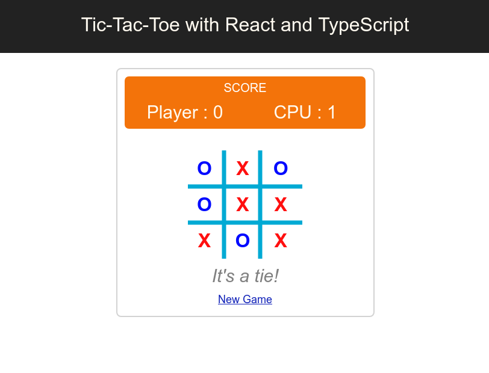

## Tic-Tac-Toe with React and TypeScript

This is a React implementation of a simple Tic-Tac-Toe game.
Most of the game logic is abstracted within this package: https://github.com/williangaspar/tic-tac-toe which you can grab and implement the game in any JavaScript framework you like.



Starting the app:
```bash
npm install
npm start
```
Testing:
```bash
npm test
```

